# phase3_final_project

### CUSTOMER CHURN PREDICTION FOR SYRIATEL

### INTRODUCTION

- Customer churn is a major challenge for telecommunications companies like SyriaTel.Losing customers not only impacts revenue but also increases the cost of acquiring new ones.To address this,SyriaTel wants to identify patterns that lead to customer  churn and take proactive measures to retain them.By analyzing customer behaviour and usage ,This project aims to develop a predictive model that helps the company reduce churn and improve customer satisfaction.

### BUSINESS UNDERSTANDING

- OBJECTIVE 
- The goal is to predict customer churn for SyriaTel,a telecommunications company.Churn means a customer is likely to stop using SyriaTel's services soon.This is a binary classification problem where the target variable is whether the customer churns or not by looking at the following:  

~ To determine which factors influence customers churn.

~ To identify and specify which customers segments with high churn rate.

~ To create intervention strategies based on the model predictions.

### PROBLEM STATEMENT

- SyriaTel has been facing a decline in customer rentention with many users discontinuing their services.The company needs a reliable way to predict which customers are at risk of leaving.This project focuses on building a machine learning model to analyze customer data and identify key factors contributing to churn.With these insights,SyriaTel can implement targeted rentention strategies,reducing customer loss and ensuring long-term business growth. 

### DATA UNDERSTANDING

The dataset was obtained from Kaggle and it consists of 3333 customers and 21 attributes giving details of various aspects of customer behaviour and service usage.The attributes include account length,area code,number of customer service calls and indicators of subcription to international and voicemail plans.The target variable "Churn" indicates whether a customer has discontinued the service.

The columns are as follows:
State:the state the user lives in.
account length:the number of days the user has this account.
area code:the code of area the user lives in.
phone number:the phone number of the user.
international plan:true if the user has international plan,otherwise.
voice mail plan :true if the user has the voice plan,otherwise false.
number vmail messages: the number of voicemail messages the user has sent the user has sent.
totay day minutes:total number of minutes the user has the been in cells during the day.
total day calls :total number of minutes the user has been in calls during the day
total eve calls : total amount of money the user has been in calls during the evening.
total eve charge:total amount of money the user has been in calls during the night.
total night minutes: total number of minutes the user has been in calls during the night.
total night calls: total number of calls the user was charged by syriatel company during the evening 
total night charge:total amount of money the user was charged by syriatel 
total intl minutes:total number of minutes the user has been in international calls
total int calls:total number of international calls the user has done 
total intl charger:total amount of money the user was charged by the syriatel company for calls during the international calls
customer service calls :number of customer service calls the user has done.
churn: true if the user terminated the contract ,otherwise false.

####  Data analysis

### DATA CLEANING
Here in data cleaning we are going to check for null values ,duplicates,dropping the variables e.g the phone number column etc.

### EXPLATORY DATA ANALYSIS
we are going to do visualization of the dataset.

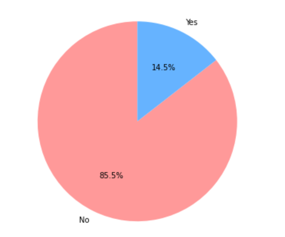

#### Findings
- This pie chart interprets that majority of customers remained with the company because its represented by 85.5% of customers who did not churn.

- The blue portion 14.5% represented customers who did churn,meaning they left the company.

### Area Code Distribution

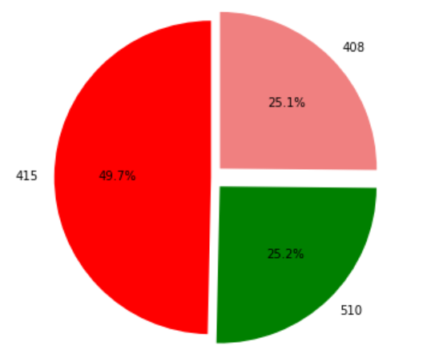

### Subscription plan distribution

- There are 3 categorical features that we will be analysing ; state,international plan,voice mail plan

State

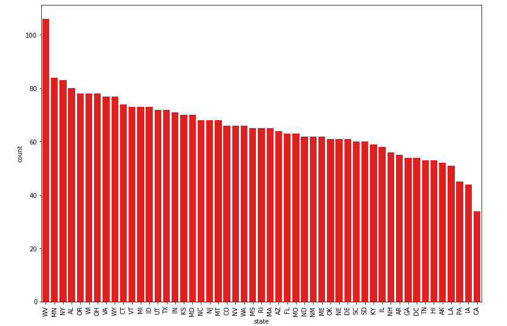

- Most subcribers are from West Virginia(WW),Minnesota(MN),NewYork(NY),Alabama(AL),Wings Consin(WC) while California(CA) has the least number subcribers.

 Internationa plan 
 
 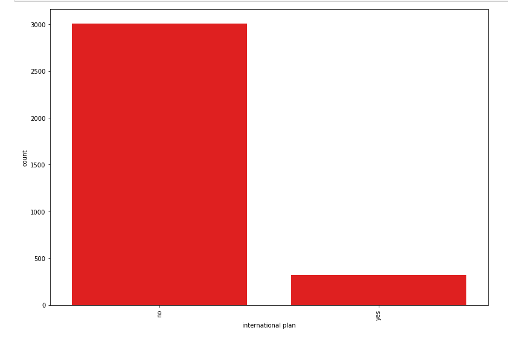

- In international plan only 323 have subscribed to  the services while 3010 have not subcribed

### Minutes  Distribution

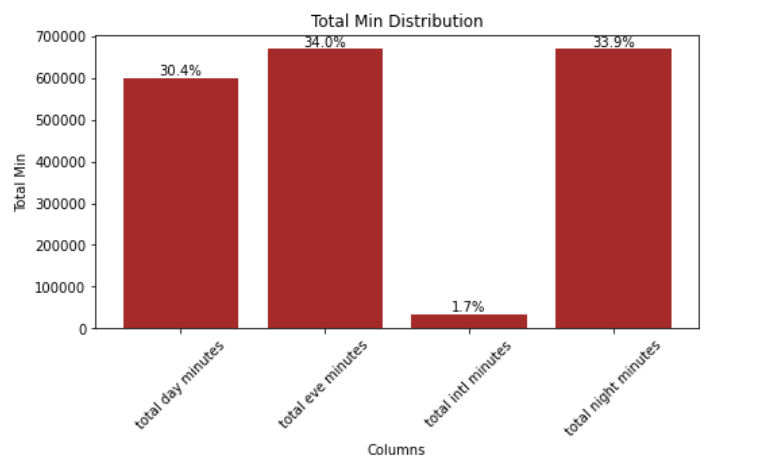

### FINDINGS

- This bar graph represents the distribution of total call minutes across different time periods with the majority of the call minutes being distributed across evening (34.0%),night (33.9%),day (30.4%) with international minutes accounting for only (1.7%) of the total usage .This suggests that most customers activity occurs during non-international calls since most calls occurs during day,evening,and night.

### Correlation of features

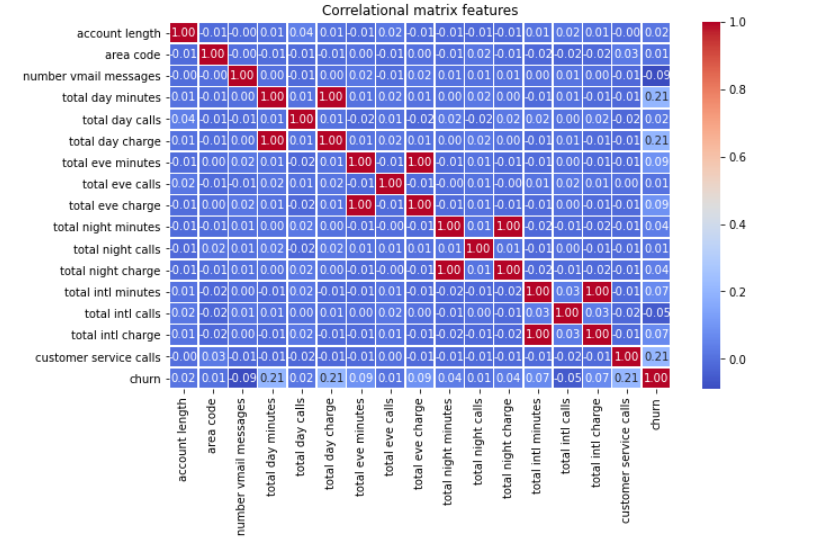

### FINDINGS

- The red areas  represent strong positive correlations(closer to 1)
- Blue areas represents weak or negative correlations(closer to 0 or -1)
- Features like total day minutes,total day charge ,today evening charge and total night charges are highly correlated,which is expected.
- Churn has a weak correlation with customer service calls meaning more service calls might slightly increase the likelihood of churn.

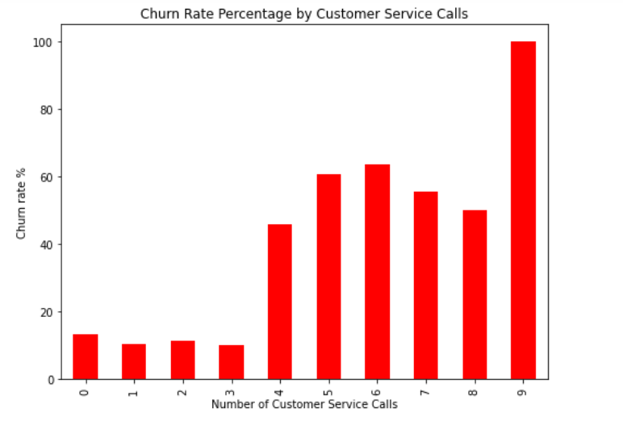

### Findings

- This bar chart shows the relationship between the number of customer service calls and churn rate perecentage.
- Customers with fewer service calls (0-3) hav a low churn rate,meaning they are generally satisfied and less likely to leave.
- From 4 customer service calls onwards,churn rate increases significantly,indicating dissatisfaction.
- At 9 customer service calls,the churn rate reaches nearly 100%,meaning almost all customers who called this many times ended up leaving.

### DATA PREPARATION AND MODELLING

1.One hot encoding 
2.Train test split

### DATA MODELLING 

#### 1. Logistic Regression Model
- we are going to use logistic regression as the baseline model.

- Logistic regression predicts the probability that an observation beolongs to a particular class using the logistic(Sigmoid) function.It has two possible outcomes either 'Yes' or 'No' 

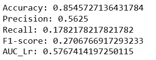

- The Accuracy score is 85.46% which idicates that the model correctly classifies customers churn status .
- The Precision score of 56.25% which suggest that when the model predicts a customer will churn and its correct by 56.25% of time.
- The recall score is relatively low meaning the model is not capturing a significant portion of actual churners .
- The F1_score is 27.07% which balances precision and recall its quite low indicating the poor performance in indentifying churner.
- The AUC score is only slightly above 0.5 which means the model is slightly better  than random guessing at distinguishing between customers who churn and who doesnt churn.

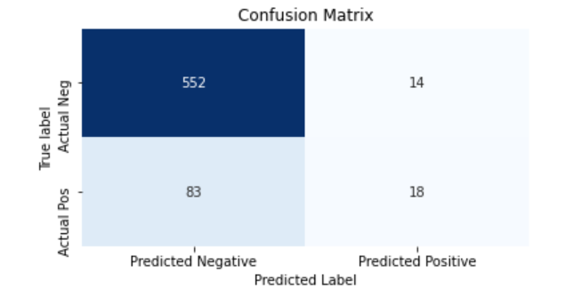

- The model correctly identifies 552 customers 

### Random Forest

- The accuracy score is 92.8% hence it makes correct predictions most of the time. 

- Precision score is a perfect precision meaning all the predicted positives are actual positives.

- The recall score 52.5% which shows the  model is missing almost half of the actual positives.

- The F1-score 68.8% shows the balance between precision and recall

#### Conclusion 

- The high precision but low recall suggests that the model is conservative in predicting the positive class 
- The F1-score is moderate meaning there is room for improvement 

### Confusion Matrix 

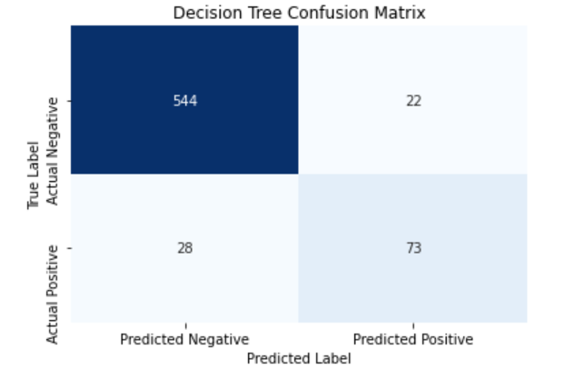

- True Negatives(TN) - 566 which correctly predicted negatives

- False Positives(FP) - Here we have No negative instances were wrongly classified as positive which explains the perfect precision.

- False Negative(FN) - 48 missed 48 actuaal positive cases.

- True Positive(TP) -53 which correctly identified positives .

#### Conclusion

- The high false negatives shows the model is missing many actual churn cases which aligns with the low recall 

- Perfect Precision but Low Recall shows the model is very cautious in predicting positives possibly due to an  imbalanced dataset.

### Decision Tree Model

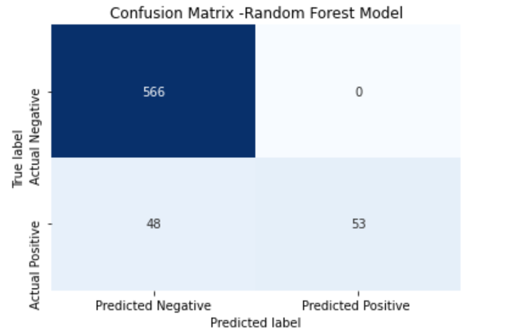

- Accuracy of 92.5% the model is making correct predictions most of the time.

- Precision of 76.8% the model predicts a positive cases.

- Recall of 72.3% the model identifies 72.3% of actual positive cases.

- F1-score of 74.5% shows a balanced measure of precision and recall,indicatinga decent overall performance.

- AUC(roc_auc_score) of 84.19% is the model has a good ability to distinguish between classes.

### Conclusion

- The Desicion Tree model performs well with a high accuracy of 92.5% and a good AUC score(84.9%),indicating a strong ability to differentiate between classes..

#### Confusion Matrix

- The Decision Tree Model correctly classified 544 true negatives and 73 true positives but misclassified 22 false positives and 28 false negatives,indicating a slighty better performance in detecting negative cases.

#### Hyperparameter Tuning 

- The hyperparameter tuning has improved the accuracy to 93.59% which is an improvement from the previous 92.8%.
- max_depth:None(this means the trees can grow fully), max_features:auto(meaning using aall features for splitting), min_sample_leaf:1(allowing deeper trees), min_samples_split:2 (it splits nodes even with just two samples),n_estimators:20( it uses 20  trees in the forest).

- The grid search has proved effective in optimizing model performance thus resulting in a more accurate churn prediction model.

#### The AUC values of Logistic Regression, Random Forest and Decision Tree Model.

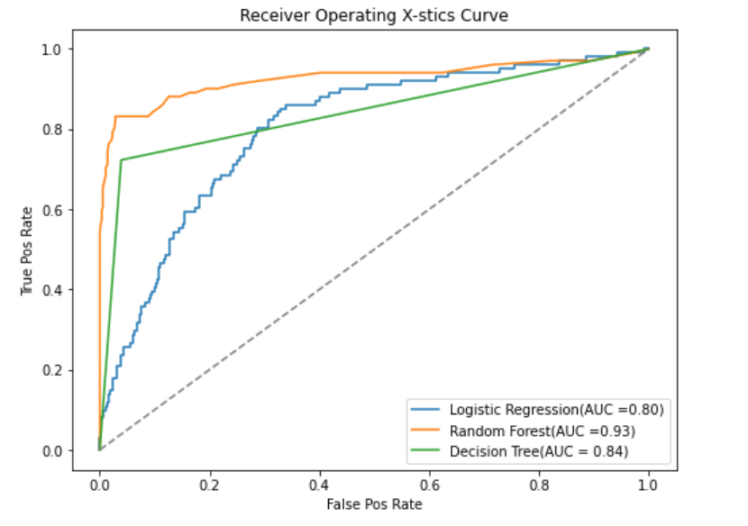

#### MODEL EVALUATION

##### Logistic Regression 

- Accuracy:0.8546, Precision :0.5625, Recall:0.1782, F1-score:0.2706 ,AUC_Lr:0.5767 
- Summary :The model has high accuracy but poor recall and F1-score indicating that its biased towards predicting non-churners hence its not effective in identifying actual churners. 

#### Decision Tree

- Accuracy:0.9250,Precision:0.7684,Recall:0.7227,F1-Score:0.7449,AUC_Dt:0.8419
- Summary:The Decision tree model has significantly improved the recall and presicion compared to logistic regression making it better at detecting churn.

#### Random Forest

- Accuracy: 0.9280, Precision:1.0 ,Recall:0.5248 F1-score:0.6883,AUC_Rf:0.7624
- Summary : The regression Model seems to be the best model since it has a very precision and a good overall accuracy 

#### Feature Importance in Random Forest 

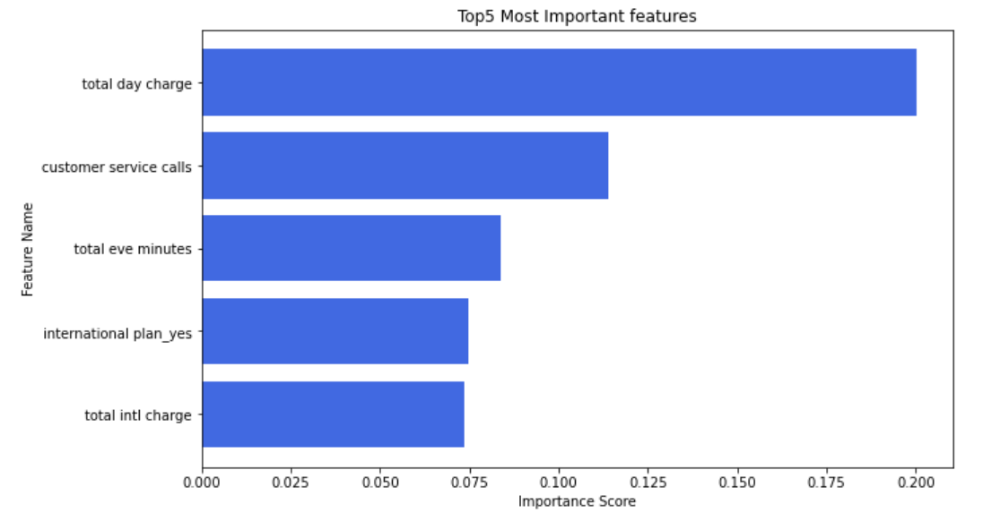

### Findings

1. Total day charge -indicates that higher charges correlate with increased churn probability.

2. Customer service calls - more calls to customer service indicate higher churn risk 

3. Total Evening minutes -indicates that more evening call time affects rentention.

4. International Plan(Yes/No)- Customers with international plans showed a higher tendency to churn.

5. Total International Charge -Higher international call charges impact churn behaviour.

### Conclusion
- The feature importance analysis reveals the factors influencing customer churn.Higher total day and international call charges increases churn probability .Frequent customer service calls indicate dissatisfaction,leading to a higher churn risk.

- customers with international plans are more likely to leave and longer evening call durations impact retention.

### Recommendations

1. Monitor High-spending customers: by identifying customers with high total day and international charges and offer discounts or Loyalty rewards to encourage retention or provide personalized plans to reduce churn due to costs concerns.

2. Improve Customer support - by analyzing customer service interactions to determine common complaints and investing in proactive customer support to resolve issues before they escalate. 

3. Developing a churn Prevention strategy -use early warning systems to detect at risk customers and send targeted retention offers by implementing feedback loops where customers can express concerns before they decide to leave.

4. Analyze call usage patterns - by creating tailored call plans based on usage trends to offer better value for evening callers and conducting surveys to understand customers preferences and adapt pricing structures accordingly.

5. Review international plan offers - customers with international plans show a significant churn risk also by improving international plan pricing network quality or promortional incentives to retain these users.

### Next steps

- Improve the Model performance -Continuously fine-tuning the churn prediction model to enhance accuracy and reliability.
- Enhancing data quality - Identify and incorporate additional customer behaviour patterns and engagement metrics to strenghthen predictions
- Deploy for Business Use -Intergrating the model into company systems to provide actionable churn insights for rentention strategies.
- Track and Maintain Accuracy 

